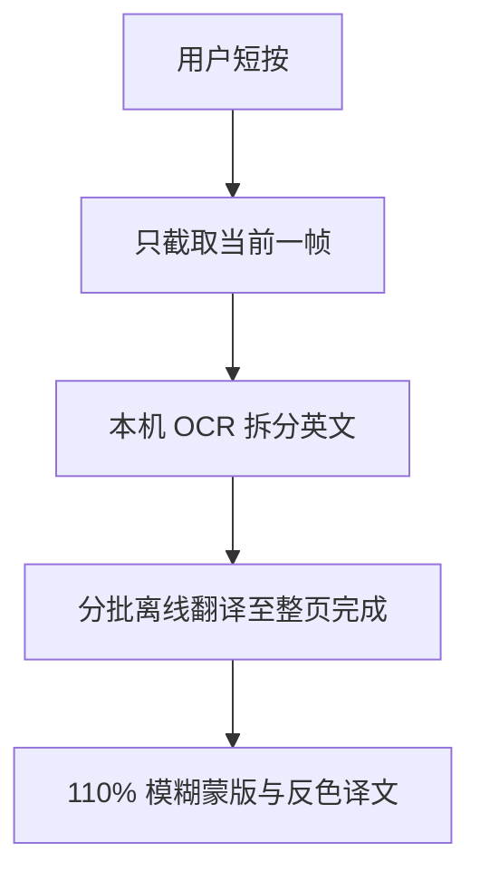

# 屏译·安全术语版 2.1.0

[](https://github.com/hjf561503-dot/ScreenSecTranslator/actions/workflows/build-apk.yml)
[](https://github.com/hjf561503-dot/ScreenSecTranslator/actions/workflows/codeql.yml)

面向网络安全学习场景的 Android 悬浮屏幕翻译工具。2.1.0 已删除后台实时扫描：短按悬浮球只在本机截取一帧，并在这张画面内分批处理到整页英文全部完成；连续按住满 3 秒才尝试调用用户配置的云端代理。

## 2.1.0 交互与覆盖规则

- 不存在定时器、自动刷新或“页面不动再扫一次”的后台循环。
- 短按：本机 OCR + ML Kit 英译中 + 网络安全术语修正。一次点击会连续处理所有批次，不需要重复点击。
- 长按：手指保持满 3 秒且未拖动时才触发一次云端精译。短于 3 秒只会执行本地翻译。
- 纯英文行按整行翻译；中英混排行按 OCR 元素拆分，任何含汉字的源片段都不会送入本地或云端翻译器。
- 不限制每页候选行总数。翻译会分批完成，但始终使用同一张主动截图。
- 译文显示前必须通过质量闸门：含内部占位符、没有中文、等同英文原文、损坏 URL/IP/CVE/哈希/路径/工具名/安全缩写的结果会被拒绝。
- 恢复英文原文的句末标点序列；URL、IP、版本号、命令和标识符内部的标点保持不变。
- 每个原文字框先绘制总宽高为原框 110% 的局部模糊蒙版，再在其上放置译文。
- 每个框从截图区域计算主色，优先使用 RGB 反色；对比度不足 4.5:1 时自动切换黑色或白色。

机器翻译无法在所有开放文本上作出数学意义的 100% 正确保证。本项目通过安全术语表、逐元素语言隔离、保护标识符、输出质量校验和标点恢复来阻止已知坏结果；无法通过校验的结果不会覆盖原文。

## 工作流程



云端精译是独立路径，只由满 3 秒长按触发，不会被本地流程自动调用。

## 使用方法

1. 安装并打开 App。
2. 首次下载约 30MB 的 ML Kit 离线中英翻译模型；模型存在时不会重复下载。
3. 点击“启动按需屏幕翻译”，允许悬浮窗、通知和系统录屏权限。
4. 切换到目标页面，短按“译”悬浮球，本机会处理到当前整页完成。
5. 拖动悬浮球可改变位置，拖动不会触发翻译。
6. 如已配置自有代理，可连续按住悬浮球满 3 秒执行一次在线精译。

详细日志在 App 内只显示“下载详细日志”按钮，密码为 `20121013`。日志记录权限、录屏会话、取帧、OCR/翻译耗时和异常，不记录截图、OCR 原文、API 密钥或代理口令。

## 本地术语库

APK 内置 `app/src/main/assets/cyber-security-en-zh.tsv`，可从本项目公开 GitHub 分支更新。更新只下载 TSV，不上传截图或 OCR 文字，也不需要 API 密钥。Dirb、DirBuster、Nmap、Burp Suite 等产品名会作为受保护标识保留在自然中文译文中。

## 可选在线精译代理

离线短按模式不需要 Node.js 或 API 密钥。只有确实需要更强上下文时才配置代理：

```bash
cd server
cp .env.example .env.local
npm test
npm start
```

可配置 Gemini 或 OpenAI：

```dotenv
ONLINE_PROVIDER=auto
GEMINI_API_KEY=你的_Gemini_API_密钥
# OPENAI_API_KEY=你的_OpenAI_API_密钥
HOST=127.0.0.1
PORT=8787
```

同一设备通过 Termux 运行时可使用 `http://127.0.0.1:8787`。局域网或公网部署必须设置 `APP_SHARED_SECRET`，公网还必须使用 HTTPS。密码、支付、身份资料和私密页面不要触发在线精译。

云端模型被要求返回整页所有清晰英文，服务端与 Android 客户端都会二次拒绝含汉字的 `source` 和不含汉字的伪译文。截图始终作为不可信数据处理，画面中的命令和提示不会被执行。

## 权限与隐私

| 权限 | 用途 |
| --- | --- |
| `SYSTEM_ALERT_WINDOW` | 显示悬浮球、模糊蒙版和译文 |
| MediaProjection | 只在用户主动短按或满 3 秒长按时读取一帧 |
| 前台服务 | 维持已授权的按需截图会话 |
| 网络 | 下载离线模型/公开术语库，以及满 3 秒长按后的可选云端精译 |
| 通知 | 显示前台服务状态 |

- 截图不会写入相册或本地文件。
- App 不设置 `FLAG_SECURE`，不会阻止用户正常截图。
- 短按流程不向代理、Gemini 或 OpenAI 发送截图或文字。
- 受其他 App 的 `FLAG_SECURE` 保护的页面可能只得到黑屏，本项目不会绕过这种保护。

## 构建与检查

Android Studio 使用 JDK 17、Android SDK 35 打开项目并执行 `Build > Build APK(s)`。GitHub Actions 会在推送和拉取请求时运行 Node 测试、密钥扫描并构建调试 APK，CodeQL 和 Dependabot 继续监控仓库。

```bash
cd server
npm run check
npm test
```

## 官方资料

- [ML Kit Text Recognition v2 for Android](https://developers.google.com/ml-kit/vision/text-recognition/v2/android)
- [ML Kit Translation for Android](https://developers.google.com/ml-kit/language/translation/android)
- [ML Kit Translation attribution requirements](https://developers.google.com/ml-kit/language/translation/translation-terms)
- [Gemini API pricing](https://ai.google.dev/gemini-api/docs/pricing)
- [OpenAI vision guide](https://developers.openai.com/api/docs/guides/images-vision)
