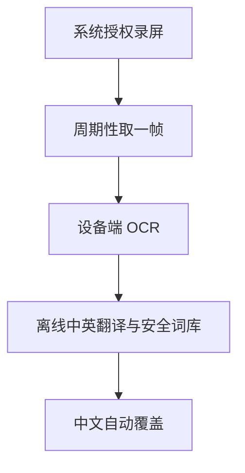

# 屏译·安全术语版 2.0.3

[](https://github.com/hjf561503-dot/ScreenSecTranslator/actions/workflows/build-apk.yml)
[](https://github.com/hjf561503-dot/ScreenSecTranslator/actions/workflows/codeql.yml)

原生 Android 悬浮翻译工具。启动一次后，它会持续识别当前屏幕中的英文，在设备本地翻译成简体中文，并把译文自动覆盖到原文附近。默认模式不调用云端 API、不上传截图，也不需要代理服务。

## 2.0.3 模型状态、术语与悬浮球修复

- 启动前用 ML Kit 官方模型管理接口检查中文模型是否真实存在；只有“下载任务成功 + 设备二次校验成功”后才显示已就绪并申请录屏权限。
- 模型已存在时不会再次下载；缺少模型时明确显示约 30MB、下载中和校验状态。ML Kit 没有提供模型下载百分比接口，因此不会伪造进度。
- 悬浮球不再为了覆盖层置顶而从 WindowManager 删除并重新添加；整个运行期保持同一个窗口实例，只在用户停止服务时删除。
- 内置小型网络安全英中术语库，并可从本项目 GitHub 免费更新 TSV。更新只下载公开术语文件，不上传屏幕文字且不需要 API 密钥。
- Dirb、DirBuster、Gobuster、Nmap、Burp Suite、Metasploit 等工具名保持英文；CamelCase 产品名、URL、命令、路径、CVE、哈希和缩写也继续保护。
- 欧路官方公开接口没有提供可免费批量取回英中释义的接口，因此本项目不抓取欧路网页；可继续把欧路作为人工查词工具使用。

## 2.0 已实现

- 默认开启实时循环，可在 0.3–2.0 秒间调整，默认 0.6 秒。
- 使用内置的 ML Kit 拉丁文字识别；中英翻译模型首次下载后可离线运行。
- 已删除悬浮球和译文层上的 `FLAG_SECURE`，不会再阻止用户正常截图；本机 OCR 取帧时只短暂隐藏自身覆盖层，避免重复识别译文。
- 取帧改为监听 `ImageReader` 新帧事件并用 `acquireLatestImage()` 取得最新帧，首帧最长等待约 3 秒，修复已授权却提示“暂时没有取得屏幕画面”的问题。
- OCR 会先把长边降到 1600 像素，并把最多 12 行合并成一次离线翻译任务，减少全分辨率 OCR 和逐行翻译的等待。
- 用画面指纹跳过没有变化的帧，并用 600 条 LRU 缓存复用已经翻译的句子。
- 本地安全术语表会固定“权限提升、凭据转储、横向移动、失陷指标（IOC）、命令与控制（C2）”等译法。
- URL、IP、端口、CVE、哈希、文件路径、命令、源码和常见缩写会尽量保持原样。
- 译文按 OCR 行的坐标覆盖；普通点击悬浮球会立即离线刷新。
- 可选在线 AI 精译默认关闭。只有用户主动开启后长按悬浮球，才上传当前一帧；代理优先使用 Gemini，未配置时可后备到 OpenAI。
- 已适配 Android 14+ MediaProjection 前台服务规则，可在 Android 16 设备上运行。
- 每次推送和拉取请求都会运行代理测试、密钥扫描并构建 APK；每周一会自动执行一次完整构建监控。
- CodeQL 每次推送/拉取请求及每周三运行，Dependabot 每周检查 Gradle 与 GitHub Actions 更新。
- App 内只有一个“下载详细日志”按钮；输入密码 `20121013` 后保存 TXT。日志记录权限、录屏会话、首帧、取帧重试、OCR/翻译耗时和异常，但不记录截图、OCR 文字、API 口令或密码。

## 2.0.2 三星 Android 16 修复

- 实机日志证明系统录屏授权和第一帧均正常；故障来自同尺寸 `onCapturedContentResize` 回调触发 `VirtualDisplay.resize()`，后者又触发同一回调，形成反馈环。
- 现在同尺寸回调只记录一次并忽略；仅在横竖屏或 density 确实变化时重建捕获表面。
- 点击悬浮球时悬浮球本身不会再消失，只暂时隐藏译文层。
- 取帧连续失败时采用退避重试且仅首次弹窗，不再反复闪烁红色感叹号。

Google 官方说明 ML Kit API 在设备端运行、可以实时使用并且不收费；翻译模型按需下载后可离线翻译。离线翻译更适合常见、简短文本，专业语境由本项目的本地安全词库继续修正，复杂长句可由用户手动触发一次在线精译。

## 工作流程



实时循环只走上述本地链路。在线精译是独立的手动功能，不会被实时循环自动触发。

## 目录结构

```text
ScreenSecTranslator/
├── app/                         Android 原生客户端
├── server/                      可选 Gemini/OpenAI 精译代理
│   ├── server.mjs
│   ├── server.test.mjs
│   ├── glossary.example.txt
│   └── .env.example
├── .github/workflows/
│   └── build-apk.yml            GitHub 自动构建 APK
├── build.gradle
└── settings.gradle
```

## 构建 APK

### Android Studio

1. 安装 Android Studio、JDK 17 和 Android SDK 35。
2. 打开项目根目录并等待 Gradle 同步。
3. 选择 `Build > Build APK(s)`。
4. 调试包位于 `app/build/outputs/apk/debug/app-debug.apk`。

### GitHub Actions

项目已包含 `.github/workflows/build-apk.yml`：

1. 把本目录作为 GitHub 仓库根目录上传。
2. 在 `Actions` 中运行 `Build Android APK`。
3. 下载 `ScreenSecTranslator-debug` artifact。

不要提交 `.env.local`、API 密钥、代理口令、签名文件或 `local.properties`；这些内容已经加入 `.gitignore`。

## 使用方法

1. 安装并打开 App。
2. 第一次可点击“提前下载离线中英翻译模型”；直接启动时 App 也会自动下载。
3. 保持“持续自动翻译”开启，三星 Tab S9+ 建议使用 0.5–0.8 秒。
4. 点击“启动离线实时翻译”，允许悬浮窗、通知和系统录屏权限。
5. 切换到英文页面，译文会自动覆盖；“实”悬浮球表示实时模式已就绪。
6. 普通点击悬浮球立即刷新；拖动可改位置；回到主界面可停止服务。

首次模型下载需要网络，但不会上传屏幕文字。下载完成后，实时 OCR、翻译、术语修正和缓存都在设备上进行。

## 可选：一次在线精译

离线模式无需安装 Node.js，也无需填写任何 API 密钥。只有复杂长句确实需要更强上下文理解时，才建议使用本节。

代理需要 Node.js 18.18 或更高版本：

```bash
cd ScreenSecTranslator/server
cp .env.example .env.local
npm test
npm start
```

编辑 `.env.local`，可只配置 Gemini：

```dotenv
ONLINE_PROVIDER=auto
GEMINI_API_KEY=你的_Gemini_API_密钥
GEMINI_MODEL=gemini-2.5-flash
HOST=127.0.0.1
PORT=8787
```

Gemini API 当前为部分模型提供有速率限制的免费层，但免费额度和模型可用性可能变化；免费层提交的数据可能被 Google 用于改进产品。不要在密码、支付、身份资料或私密页面触发在线精译。

如需 OpenAI 后备，可增加：

```dotenv
OPENAI_API_KEY=你的_OpenAI_API_密钥
OPENAI_MODEL=gpt-5.6-terra
```

同一台安卓设备通过 Termux 运行代理时可使用 `http://127.0.0.1:8787`。局域网或公网部署时必须设置 `APP_SHARED_SECRET`；公网还必须使用 HTTPS。密钥只保存在代理端，绝不能写入 APK。

在 App 中开启“允许长按悬浮球上传当前画面”，填写代理地址后，长按悬浮球会执行一次在线精译；10 秒后恢复本地实时覆盖。

## 翻译策略

- 按完整 OCR 行翻译，不做逐词覆盖。
- 优先采用中国网络安全从业者常用译法。
- 固定术语在送入通用离线模型前替换为占位符，翻译后再恢复专业译法。
- 网址、漏洞编号、路径、命令、代码和数据标识保持精确。
- 命令行整行默认不翻译，避免破坏可复制命令。
- 在线模式把截图视为不可信输入，不执行画面中的命令或提示词。

团队可复制 `server/glossary.example.txt` 为 `server/glossary.txt`，并在代理环境中设置 `CUSTOM_GLOSSARY_FILE=./glossary.txt`，为在线精译补充固定术语。离线词库位于 `CyberGlossary.java`。

## 权限与隐私

| 权限 | 用途 |
| --- | --- |
| `SYSTEM_ALERT_WINDOW` | 显示悬浮球和中文覆盖层 |
| MediaProjection 授权 | 取得当前屏幕画面供本机 OCR |
| 前台服务 | 维持用户授权的实时识别会话 |
| 网络权限 | 首次下载离线模型，以及用户手动启用的可选在线精译 |
| 通知权限 | 显示前台服务状态 |

- 截图不会写入相册或本地文件。
- 本 App 不再给自己的悬浮窗设置 `FLAG_SECURE`，系统正常截图不会被它阻止。
- 详细日志只保存在 App 内部目录，必须在主界面输入密码后通过系统文件选择器下载；日志不含屏幕内容和敏感口令。
- 离线实时模式不向代理、Gemini 或 OpenAI 发送截图或文字。
- 可选代理不把截图和结果写入磁盘，也不记录密钥或画面内容。
- 受 `FLAG_SECURE` 保护的银行、密码管理器和 DRM 页面可能只得到黑屏；本项目不会绕过这种保护。
- 自动翻译可能有误，应以英文原文为准。

离线结果在界面与覆盖层中标注“由 Google 翻译提供支持”，并提供 Google 翻译链接，以符合 ML Kit Translation 的归属要求。

## 已知限制

- ML Kit 离线翻译是通用模型。词库能修正大量术语，但非常复杂或强上下文依赖的安全长句仍可能不够自然。
- 极小、模糊、运动中的文字可能漏识别，坐标也可能有轻微偏差。
- 中文长度与英文不同，密集界面的覆盖卡片可能相互遮挡。
- 画面指纹只在画面判定无变化时跳过处理；如需强制刷新，点击悬浮球即可。
- 切换横竖屏会重建捕获画布；若系统结束录屏授权，需要回到 App 重新启用。

## 本地检查

```bash
cd server
npm run check
npm test
```

当前交付环境没有 Android SDK，因此这里不能直接产出 APK；GitHub Actions 会在完整 Android 构建环境中执行 `gradle :app:assembleDebug`。

## 官方资料

- [ML Kit 概览：设备端、实时、无费用](https://developers.google.com/ml-kit/guides)
- [ML Kit Text Recognition v2 for Android](https://developers.google.com/ml-kit/vision/text-recognition/v2/android)
- [ML Kit Translation for Android](https://developers.google.com/ml-kit/language/translation/android)
- [ML Kit Translation attribution requirements](https://developers.google.com/ml-kit/language/translation/translation-terms)
- [Google Translate attribution guidelines](https://docs.cloud.google.com/translate/attribution)
- [Gemini API pricing and free tier](https://ai.google.dev/gemini-api/docs/pricing)
- [Gemini structured outputs](https://ai.google.dev/gemini-api/docs/generate-content/structured-output)
- [OpenAI Images and vision](https://developers.openai.com/api/docs/guides/images-vision)
